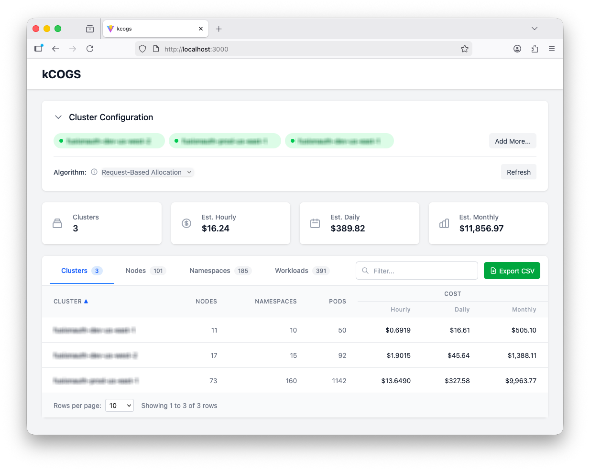

# kcogs

Get visibility into Cost of Goods Sold in Kubernetes clusters.

⚠️ This is a WORK IN PROGRESS. It currently only pulls AWS cost data.



## Localdev

Currently, the only way to use the app is to clone this repo and run it locally.

### Prerequisites

- Go 1.25
- Node 25
- Valid AWS credentials
- Valid kubeconfig file(s)

### Running the App

AWS credentials are required to retrieve cost data. Set `AWS_PROFILE` before starting the app.

```sh
export AWS_PROFILE=profile_name
```

Start the app:

```sh
make install && make dev
```

Open http://localhost:3000

### Production Build

Build a single binary with the frontend embedded:

```sh
make build
./backend/bin/kcogs
```

Open http://localhost:8080

### Environment Variables

| Variable                        | Description                                   | Default     |
| ------------------------------- | --------------------------------------------- | ----------- |
| `KCOGS_PORT`                    | HTTP server port                              | `8080`      |
| `KCOGS_LOG_LEVEL`               | Log level (`debug`, `info`, `warn`, `error`)  | `info`      |
| `KCOGS_AUTO_DISCOVER`           | Enable EKS auto-discovery (`true`/`false`)    | `true`      |
| `KCOGS_DISCOVER_REGIONS`        | Comma-separated AWS regions for EKS discovery | `us-east-1` |
| `KCOGS_PRICING_REFRESH_MINUTES` | AWS pricing cache refresh interval            | `60`        |
